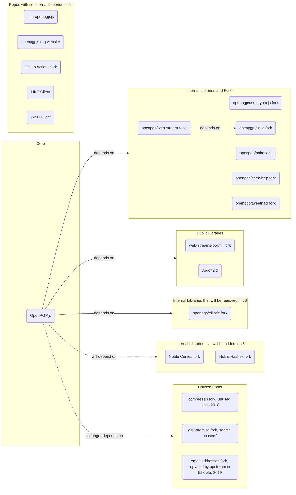

# OpenPGP.js Repositories <!-- omit in toc -->

This documents explains all repositories in the OpenPGP.js organization and how they relate to each other.

**Table of Contents**
- [Forks](#forks)
- [Repo Dependency Chart](#repo-dependency-chart)

## Forks
You will notice a large number of forked projects that are dependencies of OpenPGP.js itself. These are often due to necessary changes that are of no interest to the upstream maintainers, mostly concerning build processes, eg. making node-only libraries available for frontend use. The `tweetnacl` fork is mainly there to shrink the dependency, since most of the library isn’t used.

There’s a [useful discussion](https://github.com/openpgpjs/openpgpjs/discussions/1574) on the topic that includes some analysis of the forks in regard to their upstreams, as well as explainations from the maintainers concerning the reasons for the forks and their versioning.

## Repo Dependency Chart

