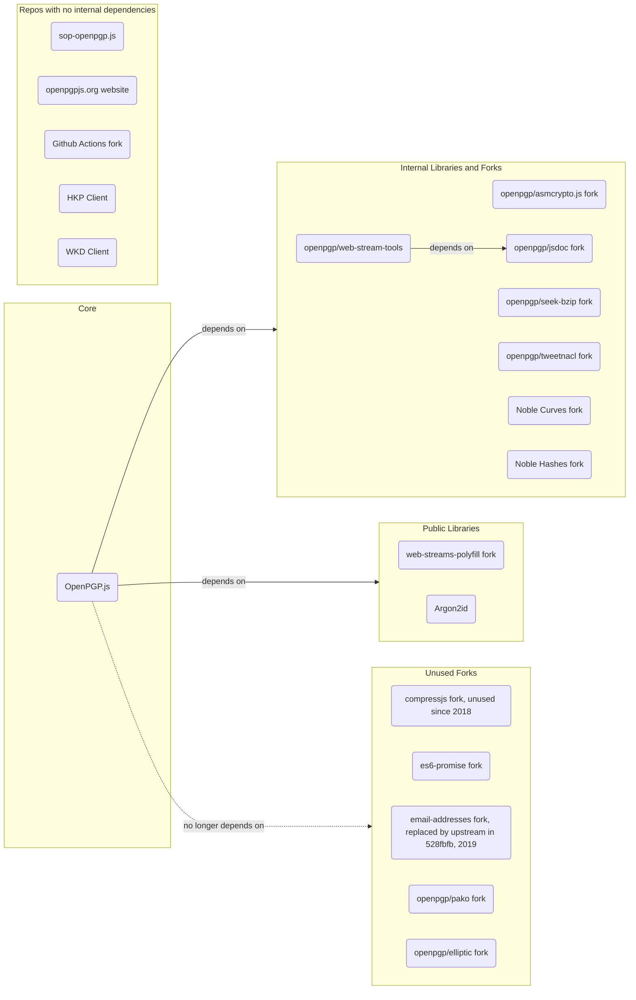

# OpenPGP.js Repositories <!-- omit in toc -->

This document explains all repositories in the OpenPGP.js organization and how they relate to each other.

**Table of Contents**
- [Forks](#forks)
- [Repo Dependency Chart](#repo-dependency-chart)
- [OpenPGP Overview](#openpgp-overview)
- [Crypto Refresh Features](#crypto-refresh-features)

## Forks

You will notice a large number of forked projects that are dependencies of OpenPGP.js itself. These are often due to necessary changes that are of no interest to the upstream maintainers, mostly concerning build processes, eg. making node-only libraries available for frontend use. The `tweetnacl` fork is mainly there to shrink the dependency since most of the library isn’t used.

There’s a [useful discussion](https://github.com/openpgpjs/openpgpjs/discussions/1574) on the topic that includes some analysis of the forks regarding their upstreams, as well as explanations from the maintainers concerning the reasons for the forks and their versioning.

## Repo Dependency Chart

## OpenPGP.js Overview
OpenPGP.js is a JavaScript implementation of the OpenPGP protocol. It implements
 [RFC 4880](https://datatracker.ietf.org/doc/html/rfc4880) and most of the [crypto refresh](https://datatracker.ietf.org/doc/draft-ietf-openpgp-crypto-refresh)
.

And consists of these main building blocks:

### Key Module
The relevant code is located in `src/key`

#### Transferable Public Keys
A transferable public key is the object that a person uses to publish (or revoke) their public key, and to have it authenticated by third parties. 
The code is located in `src/key/public_key.js`.

#### Transferable Secret Keys
Transferable secret keys are identical to transferable public keys, except they use Secret-Key and Secret-Subkey packets instead of Public-Key and Public-Subkey packets.
They're typically used by one user transferring keys between applications/devices under their control, and not for sending keys between users.
In the code, this key is referred to as a private key and its code representation is in `src/key/private_key.js`.

#### Subkeys
A Subkey is the same as a (transferable) public key but is typically used when a user does not want to use the same key pair for signing and encryption. The "root" public key will be used to sign the subkey, which will then be used for encryption.
Secret Keys can also have Subkeys. You can find the code in `src/key/subkey.js`.

### OpenPGP Messages

The class that represents an OpenPGP message is located at `src/message.js`.
It can be any of the following:

- A _literal message_:
  - The implementation of a Literal Message is the class `LiteralDataPacket` at `src/packet/literal_data.js`. A Literal Data packet contains the body of a message; data that is not to be further interpreted.
- A _compressed message_:
  - A Compressed Message is represented by the `CompressedDataPacket` class at `src/packet/compressed_data.js`.
  The Compressed Data packet contains compressed data. Typically, this packet is found as the contents of an encrypted packet, or following a Signature or One-Pass Signature packet, and contains a literal data packet.
- An _encrypted message_, which can consist of:
  - Either a Symmetrically Encrypted Data packet (`src/packet/symmetrically_encrypted_data.js`), that contains data encrypted with a symmetric-key algorithm. When it has been decrypted, it contains other packets. Usually a literal data packet or compressed data packet, but in theory other Symmetrically Encrypted Data packets or sequences of packets that form whole OpenPGP messages.
  - A Symmetrically Encrypted Integrity Protected Data packet (`src/packet/sym_encrypted_integrity_protected_data.js`) is a variant of the Symmetrically Encrypted Data packet. It is a feature created for OpenPGP that addresses the problem of detecting a modification to encrypted data. It is used in combination with a Modification Detection Code packet.
  - Accompanying the encrypted data is a set of encrypted session keys, one for each recipient. Each ESK can be one of:
    - _Public Key Encrypted Session Key_ (represented by `src/packet/public_key_encrypted_session_key.js` at `src/packet/public_key_encrypted_session_key.js`), which encrypts the session key using the recipient's public key. Includes the key ID (which may identify a subkey), the encryption algorithms used to encrypt both the session key and the message, and the encrypted session key itself.
    - _Symmetric-Key Encrypted Session Key_ (represented by `SymEncryptedSessionKeyPacket` at `src/packet/sym_encrypted_session_key.js`), which encrypts the session key using a symmetric algorithm based on a shared secret passphrase. Includes the encryption algorithms used to encrypt the session key and the message, a string-to-key specifier, and the encrypted session key.
- A _signed message_:
  - with a Signature that covers the message data, signed by the sender's private key. There are a couple of different ways of encoding this that allow the placement of the signature at either the start or the end of the message.

### Signatures
Signatures are needed to authenticate messages and public keys. They
cryptographically sign a block of data using the signer's private key, which
anyone else can then verify using their public key.

The code for signatures can be found in `src/signature.js`, `src/packet/signature.js` as well as `src/crypto/signature.js`.

### Identifiers

Users are normally identified by a name-email pair. This code can be found in `src/key/user.js`
which receives `src/packet/userid.js` and `src/packet/user_attribute.js`.

Keys are identified by a _fingerprint_, which in recent versions is derived from
a hash of the key's full content. A _key ID_ is an abbreviated form of the
fingerprint, usually the lowest 32 or 64 bits of the fingerprint (an 8 or
16-digit hex value). Key IDs should not be assumed to be unique.
The code for Key IDs is in `src/type/keyid.js`.

### String-to-Key (S2K)

Usually, the session key will encrypt using each recipient's public key, but the protocol also supports encrypting using a _symmetric_ algorithm. In this case, the users assume they all know a shared secret, a textual passphrase, rather than the encrypted session keys identifying each recipient's public key. To produce the fixed-size binary key that the encryption algorithm needs, the passphrase needs to be passed through a _string-to-key_ (S2K) function. Symmetric-Key Encrypted Session Keys include an _S2K specifier_ that describes how to do this.

There are a few types of S2K specifiers:
- _Simple_: specifies a hash algorithm, and the passphrase is simply
hashed using that algorithm to produce a key.

- _Salted_: specifies a hash algorithm and a 64-bit salt value; the passphrase is combined with the salt before hashing.

- _Iterated and Salted_: specifies a hash algorithm, a 64-bit salt, and an
  iteration count. The hashing is repeated the given number of times to make key derivation more expensive.

S2K is implemented in `src/type/s2k`.

### Crypto Module

According to the RFC OpenPGP implementations must support a couple of Algorithms for different uses.

#### Public-Key Algorithms
Implementations MUST implement [DSA](https://en.wikipedia.org/wiki/Digital_Signature_Algorithm)and should
support [RSA](<https://en.wikipedia.org/wiki/RSA_(cryptosystem)>) for signatures, and [ElGamal](https://en.wikipedia.org/wiki/ElGamal_encryption) for encryption.
These implementations can be found in `src/crypto/public_key`.

#### Symmetric-Key Algorithms
Implementations MUST implement [Triple DES](https://en.wikipedia.org/wiki/Triple_DES). Implementations SHOULD
implement [AES-128](https://en.wikipedia.org/wiki/Advanced_Encryption_Standard) and [CAST5](https://en.wikipedia.org/wiki/CAST-128).
Implementations may support AES-192, AES-256,
[Blowfish](<https://en.wikipedia.org/wiki/Blowfish_(cipher)>),
[IDEA](https://en.wikipedia.org/wiki/International_Data_Encryption_Algorithm),
and [Twofish-256](https://en.wikipedia.org/wiki/Twofish). IDEA is required for
interoperability with older PGP versions but is not implemented here.
These implementations can be found in `src/crypto/cipher`.

#### Compression Algorithms
Implementations MUST implement uncompressed data. Implementations
SHOULD implement [ZIP](<https://en.wikipedia.org/wiki/ZIP_(file_format)>), and may
support [zlib](https://en.wikipedia.org/wiki/Zlib) and
[bzip2](https://en.wikipedia.org/wiki/Bzip2).
The compression algorithms can be found in `src/packet/compressed_data.js`.

#### Hash Algorithms
Implementations MUST implement [SHA-1](https://en.wikipedia.org/wiki/SHA-1). and may support [SHA-224, SHA-256, SSHA-384, SHA-512](https://en.wikipedia.org/wiki/SHA-2),
[MD5](https://en.wikipedia.org/wiki/MD5) and
[RIPEMD-160](https://en.wikipedia.org/wiki/RIPEMD). MD5 is deprecated but
retained for backward compatibility.
These algorithms are implemented in `src/crypto/hash`.

## Crypto Refresh Features

A new version of the OpenPGP spec called [crypto-refresh](https://datatracker.ietf.org/doc/draft-ietf-openpgp-crypto-refresh), will be published as an RFC soon. 
Its main purpose is to update the algorithms used in OpenPGP to include advances in cryptography since RFC 4880 was published.

With v6 of OpenPGP.js most of crypto refresh features will be available:

- support for v6 keys, signatures, and encrypted-session keys & more (behind feature flag openpgp.config.v6Keys)
- support for AEAD-protected encrypted messages (new format, behind feature flag openpgp.config.aeadProtect) - support for Argon2
- support for Ed448 & X448
- support for generating Ed25519 & X25519 keys in new format

More info in this [discussion](https://github.com/openpgpjs/openpgpjs/discussions/1695)

